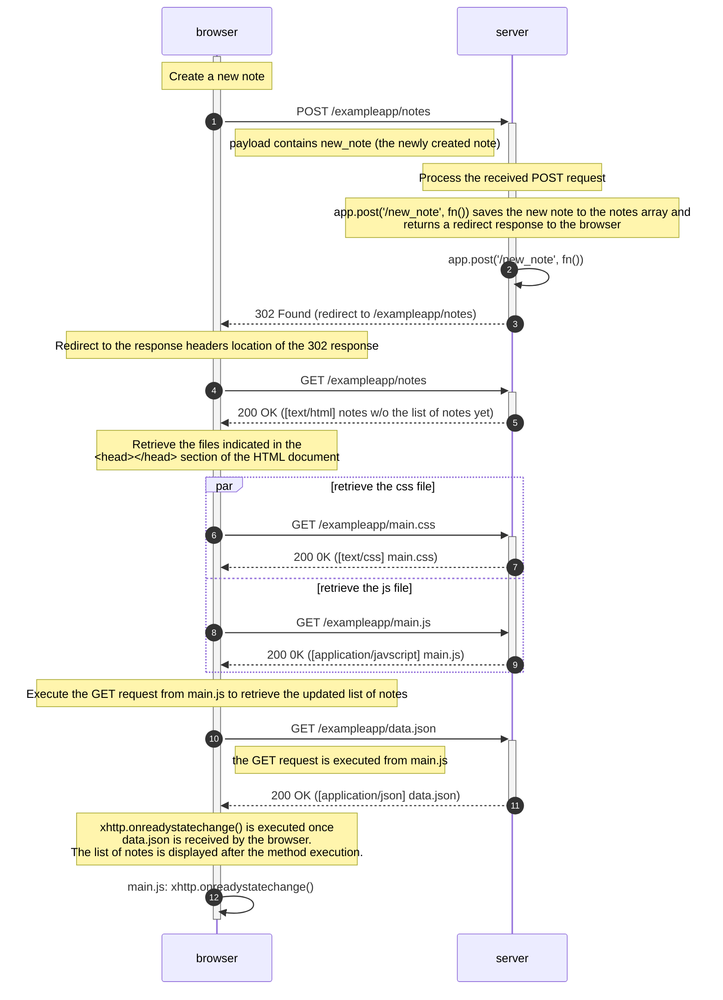

# Sequence diagram: POST /exampleapp/note

The sequence diagram (SD) for creating a new note is almost similar (or an extension of) to the [SD of loading the page for the notes app](https://fullstackopen.com/en/part0/fundamentals_of_web_apps#loading-a-page-containing-java-script-review). After the sequence for creating a new note (until the `302 Found` response), the next sequence will be the SD for loading the page of the notes app, which would reload the page to retrieve the newly updated notes data.