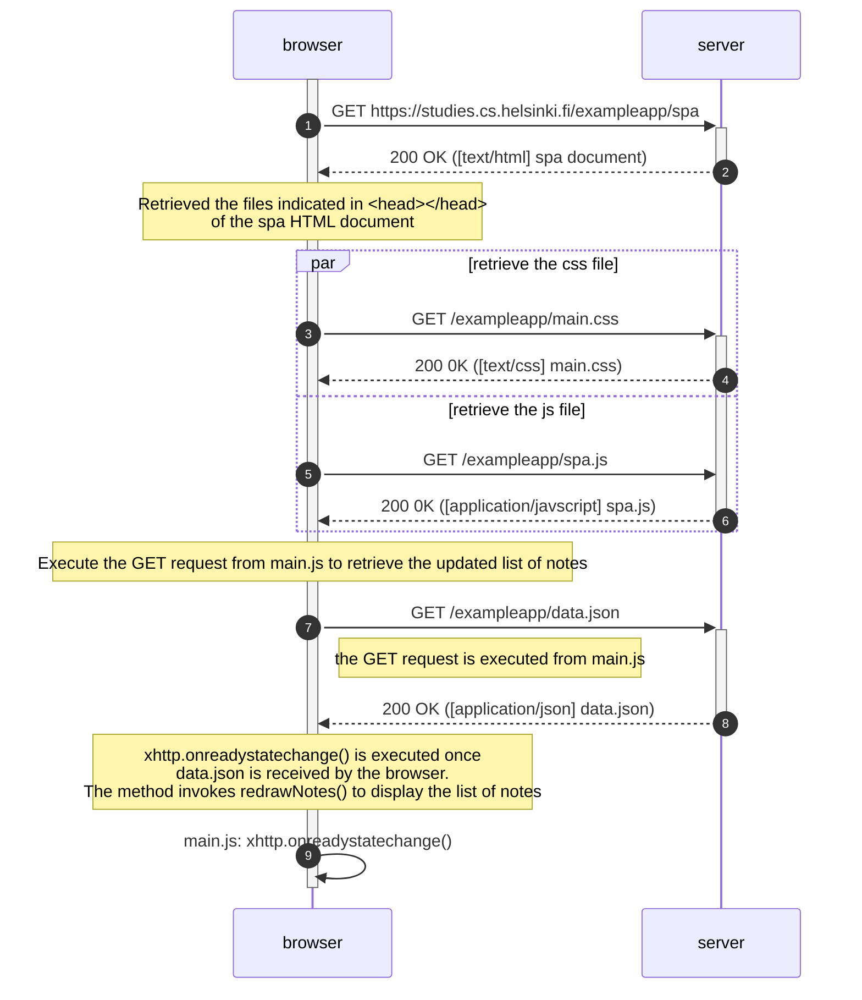

# Sequence diagram: Notes Single Page Application (SPA)

The sequence diagram (SD) for the Notes SPA is similar to the [SD of loading the page for the "traditional" notes app](https://fullstackopen.com/en/part0/fundamentals_of_web_apps#loading-a-page-containing-java-script-review). However, the difference between the two is that the SPA version retrieves a different javascript file (`spa.js`) that enables it to process the creation of notes without reloading the page.