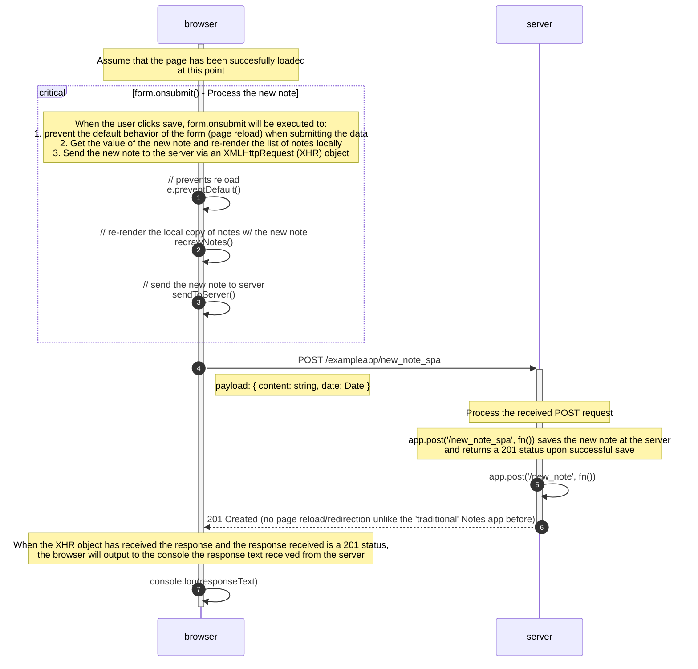

# Sequence diagram: SPA POST /exampleapp/new_note_spa

The sequence diagram (SD) for creating a new note in the Notes SPA takes a different approach in saving the new note to the server. Instead of immediately sending the new note upon clicking the save buttong, the SPA will (1) prevent the default behavior (page reload) of submitting form data, (2) re-render the local list of notes with the new note, and (3) send the new note to the server. While there are better approaches to prevent rendering issues and guarantee data persistence (as indicated by the lesson), the Notes SPA is a good way to show how we can make web apps behave in a "more modern" way.